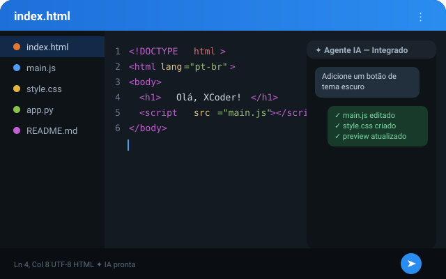
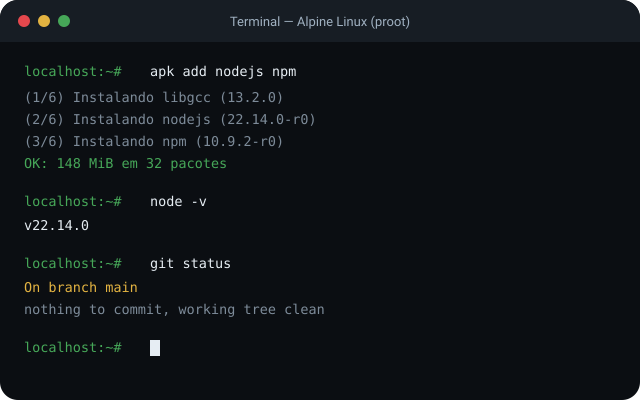
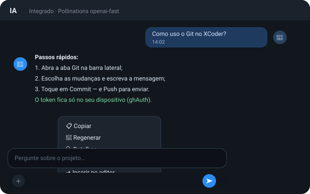

<div align="center">

<!-- TODO: trocar pelo novo ícone do app quando estiver pronto (atualmente res/logo.png) -->


# XCoder

**Editor de código rápido e offline-first para Android** • **Fast, offline-first code editor for Android**

🤖 Agente de IA / AI agent • 🐧 Terminal Linux • 🧠 LSP • 🚫 Sem anúncios / No ads • 🔒 Sem conta / No account

[🇧🇷 Português (Brasil)](#português-brasil) | [🇺🇸 English](#english)

### Status de build / Build status

[](https://github.com/carsaimz/xcoder/actions/workflows/ci.yml)
[](https://github.com/carsaimz/xcoder/actions/workflows/debug.yml)
[](https://github.com/carsaimz/xcoder/actions/workflows/release.yml)
[](https://github.com/carsaimz/xcoder/actions/workflows/codeql.yml)
[](https://api.scorecard.dev/projects/github.com/carsaimz/xcoder)

### Repositório / Repository

[](https://github.com/carsaimz/xcoder/releases)
[](LICENSE)
[](https://github.com/carsaimz/xcoder/stargazers)
[](https://github.com/carsaimz/xcoder/network/members)
[](https://github.com/carsaimz/xcoder/graphs/contributors)

[](https://github.com/carsaimz/xcoder/issues)
[](https://github.com/carsaimz/xcoder/pulls)
[](https://github.com/carsaimz/xcoder/commits/main)
[](https://github.com/carsaimz/xcoder/graphs/commit-activity)
[](https://github.com/carsaimz/xcoder/search?l=javascript)
[](https://github.com/carsaimz/xcoder)

</div>

---

<a id="português-brasil"></a>

## 🇧🇷 Português (Brasil)

O XCoder é um editor de código mobile-first para Android focado em privacidade
e uso offline. Ele entrega uma experiência completa de edição — realce de
sintaxe para mais de 100 linguagens, integrações LSP, gerenciamento de arquivos
compatível com Git, um terminal Alpine Linux (proot) e um servidor local de
pré-visualização — **sem** exigir conta, exibir anúncios ou enviar telemetria.

## ✨ Destaques

- 🤖 **Assistente de IA com agentes e subagentes** — traga sua própria chave
  **ou use o provedor Integrado sem chave**. O agente pode ler e analisar seu
  projeto, criar/editar/excluir arquivos, executar JavaScript em um sandbox
  isolado, usar um shell virtual (com VCS de snapshots local) e criar
  subagentes somente leitura para tarefas de pesquisa. Você aprova cada ação
  sensível.
- 🔌 **Gerenciador de provedores de IA** — presets em três grupos:
  - *Integrado (sem chave, grátis)*: Pollinations (texto + **geração de
    imagens** com `/image`) e DuckDuckGo AI (experimental)
  - *Grátis com chave*: Groq, OpenRouter (modelos gratuitos), Cerebras, Hugging Face, Cloudflare Workers AI
  - *Pagos com nível gratuito*: Google Gemini, OpenAI, Mistral, DeepSeek, Together, Cohere, GitHub Models, Fireworks
  - *Premium*: Anthropic, xAI, Perplexity, Azure OpenAI, NVIDIA NIM
  - Ou aponte para **qualquer endpoint compatível com OpenAI** (Ollama, LM Studio, vLLM, LiteLLM).
- 💬 **Chat moderno estilo Claude/DeepSeek** — avatares de usuário e IA,
  botões de enviar/anexar abaixo da caixa de texto, streaming ao vivo com
  "pensamento" expansível e **ações ao pressionar uma mensagem**: copiar,
  regenerar, detalhar, resumir, continuar e inserir no editor.
- ✍️ **Editor**: núcleo CodeMirror 6, mais de 100 linguagens, autocompletar,
  dobramento, múltiplos cursores, ferramentas rápidas, mais de 20 temas de
  editor, fontes personalizáveis.
- 🧠 **LSP**: TypeScript, JavaScript, Python, HTML, CSS, JSON, Tailwind e mais
  — diagnósticos, autocompletar, hover, ir para definição, renomear, formatar.
- 🐧 **Terminal**: shell Alpine Linux real via proot com executores em segundo
  plano e um gerenciador de pacotes estilo Termux.
- 📂 **Arquivos**: armazenamento local, cartão SD, backends SFTP e FTP,
  workspaces multi-raiz, busca e substituição poderosas entre arquivos.
- 🌐 **Pré-visualização ao vivo**: servidor HTTP integrado + preview no
  navegador do app e console.
- ☁️ **Sincronização em nuvem opcional**: backend no GitHub ou Firebase para
  backup de configurações e conversas de IA.
- 🛰️ **Site embutido**: aba lateral "Website" abre a documentação, o
  marketplace e a página de patrocínios dentro do próprio app.
- 🔄 **Verificador de atualizações**: consulta opcional aos GitHub Releases
  (perguntado na primeira execução; também disponível em *Sobre → Verificar
  atualizações*).
- 🔌 **Plugins**: marketplace com mais de 16 plugins da comunidade (toggle de
  comentários, ferramentas JSON, gerador de UUID, emojis, cores, sumário de
  Markdown e mais) — instale por URL ou arquivos locais.
- 🆓 **Tudo grátis** — nenhum recurso é bloqueado. Doar só remove os anúncios
  e amplia os limites de IA (Premium opcional).
- 🌍 **30 idiomas de interface** — segue o idioma do dispositivo (Português
  como padrão de fallback).

## 📲 Download

Baixe o **APK/AAB** assinado mais recente na
[página de Releases](https://github.com/carsaimz/xcoder/releases). Builds beta
(`-beta.*` / `-rc.*`) são publicados como pre-releases.

Builds de depuração (`v1.x.x-debug`) são gerados automaticamente a cada push —
abra o
[workflow Debug APK](https://github.com/carsaimz/xcoder/actions/workflows/debug.yml),
escolha a execução mais recente e baixe o artefato.

## 📸 Capturas de tela

> Renderizações ilustrativas da interface (tema Dark+). Capturas reais de
> dispositivo são bem-vindas via PR — adicione em
> [`docs/screenshots/`](docs/screenshots).

| Editor + agente IA | Terminal Alpine | Chat IA (ações) |
| :---: | :---: | :---: |
|  |  |  |

## 🛠️ Build

Requisitos: Node 18+, Java 17, Android SDK (API 36).

```bash
npm install          # instala as dependências
npm run setup        # adiciona plataforma android + plugins
npm run build        # APK de debug
npm run build p      # APK de release
npm run build p bundle  # AAB de release
```

Apenas o bundle web (útil para desenvolvimento PWA):

```bash
npx rspack --mode development
```

Rodar a suíte de testes:

```bash
npm test
```

## 🤖 Início rápido com o agente de IA

1. Abra uma pasta de projeto.
2. Toque na aba **IA** na barra lateral.
3. Comece a conversar — o provedor **Integrado** (Pollinations) funciona
   **sem chave e sem conta**. Para mais poder, abra *Configurações →
   Assistente de IA* e escolha um provedor (ex.: **Groq** — grátis) com a sua
   chave de API.
4. Pergunte qualquer coisa: "explique este projeto", "adicione um toggle de
   dark mode", "encontre todos os usos de X e refatore". Use `/image` para
   gerar imagens e pressione uma mensagem para copiar, regenerar, detalhar
   ou resumir a resposta.

O agente pergunta antes de modificar qualquer coisa, a menos que você aumente
o nível de autonomia dele.

## 🌍 Idiomas e traduções

O XCoder vem com 30 idiomas de interface. Na primeira execução ele segue o
**idioma do dispositivo** quando há tradução disponível, usando **Português
(Brasil)** como padrão. Você pode trocar quando quiser em *Configurações →
App → Idioma*.

Traduções novas ou melhoradas são bem-vindas: edite o arquivo
`src/lang/<locale>.json` correspondente (use `en-us.json` como referência de
chaves) e abra um pull request.

## 📁 Estrutura do projeto

```
src/                 código-fonte do app (editor, fs, terminal, LSP, IA)
  lib/ai/            agente de IA, tools, cliente de provedores, shell virtual
  cm/                integração CodeMirror 6
  lang/              traduções da interface (30 locales)
  plugins/           plugins Cordova vendored (terminal, server, sftp, ...)
utils/               scripts de build/desenvolvimento
res/                 ícones e recursos Android
.github/             CI, automação de releases e configuração de bots
```

## 🆓 Grátis, Premium e apoio

**Todos os recursos do XCoder são livres.** O Premium opcional existe apenas
para apoiadores e faz duas coisas: remove os anúncios de casa e amplia os
limites de IA (agente ilimitado, respostas de até 8k tokens, autonomia
"automática"). Nada mais muda — temas, plugins, terminal, Git e o editor
completo são grátis para todo mundo.

Doações são feitas pela página **Apoie o projeto** (dentro do app ou em
[xcoderapp.vercel.app/sponsor](https://xcoderapp.vercel.app/sponsor)) — com
M-Pesa, e-Mola, PayPal, GitHub Sponsors e mais. A doação vira Premium
automaticamente na sua conta do site.

## 🔒 Privacidade

O XCoder **não** tem telemetria. As únicas requisições de rede são as que você
faz: chamadas a provedores de IA que você configura, servidores FTP/SFTP que
você adiciona, zips de plugins que você instala por URL e a verificação
opcional de atualizações nos GitHub Releases do projeto (pode ser
desativada nas configurações).

## 🤝 Contribuindo

Issues, pull requests e traduções são bem-vindas! Leia o
[CONTRIBUTING.md](CONTRIBUTING.md) para começar. O projeto mantém o CI verde
(typecheck, testes, build) — por favor rode `npm test` antes de fazer push.

## 📈 Estatísticas do repositório

[](https://github.com/carsaimz/xcoder/graphs/contributors)

[](https://star-history.com/#carsaimz/xcoder&Date)

## 🙏 Agradecimentos

O XCoder se apoia em gigantes:

- **[Acode](https://github.com/deewarz/acodeapp)** (© Foxdebug / Ajit Kumar) —
  o incrível editor do qual este projeto é fork.
- **Bibliotecas open-source** — CodeMirror 6, xterm.js, markdown-it, KaTeX,
  Mermaid, DOMPurify, Emmet, motion, html-tag-js, JSZip e todas as
  dependências do [`package.json`](package.json).
- **[Contribuintes](https://github.com/carsaimz/xcoder/graphs/contributors)** —
  todos que contribuem com código, documentação e traduções.
- **Comunidade** — testadores, tradutores e quem reporta erros. Obrigado!

## 📄 Licença

[MIT](LICENSE) — baseado no excelente trabalho open-source do projeto
Acode (© Foxdebug / Ajit Kumar).

XCoder é desenvolvido e mantido por **Carsai Mozambique**
([@carsaimz](https://github.com/carsaimz)).

<div align="center">

[🇧🇷 Português (Brasil)](README.md) | [🇺🇸 English](README.en.md)

</div>

---

<a id="english"></a>

## 🇺🇸 English

XCoder is a mobile-first code editor for Android focused on privacy and offline
usage. It ships a complete editing experience — syntax highlighting for 100+
languages, LSP integrations, Git-friendly file management, an Alpine Linux
terminal (proot) and a local live preview server — **without** requiring an
account, showing ads or sending telemetry.

## ✨ Highlights

- 🤖 **AI assistant with agents & subagents** — bring your own key. The agent
  can read and analyze your project, create/edit/delete files, run JavaScript
  in an isolated sandbox, use a virtual shell (with a local snapshot VCS) and
  spawn read-only subagents for research tasks. You approve every sensitive
  action.
- 🔌 **AI provider manager** — presets in three groups:
  - *Built-in (keyless, free)*: Pollinations (text + **image generation**
    via `/image`) and DuckDuckGo AI (experimental)
  - *Free with key*: Groq, OpenRouter (free models), Cerebras, Hugging Face, Cloudflare Workers AI
  - *Paid with free tier*: Google Gemini, OpenAI, Mistral, DeepSeek, Together, Cohere, GitHub Models, Fireworks
  - *Premium*: Anthropic, xAI, Perplexity, Azure OpenAI, NVIDIA NIM
  - Or point to **any OpenAI-compatible endpoint** (Ollama, LM Studio, vLLM, LiteLLM).
- 💬 **Claude/DeepSeek-style chat** — user & AI avatars, send/attach buttons
  on a dedicated row below the input, live streaming with an expandable
  thought process, and **long-press message actions**: copy, regenerate,
  explain in detail, summarize, continue and insert into the editor.
- ✍️ **Editor**: CodeMirror 6 core, 100+ languages, autocompletion, folding,
  multi-cursor, quick tools, 20+ editor themes, customizable fonts.
- 🧠 **LSP**: TypeScript, JavaScript, Python, HTML, CSS, JSON, Tailwind and
  more — diagnostics, completions, hover, go-to-definition, rename, formatting.
- 🐧 **Terminal**: real Alpine Linux shell via proot with background executors
  and a Termux-style package manager.
- 📂 **Files**: local storage, SD card, SFTP and FTP backends, multi-root
  workspaces, powerful search & replace across files.
- 🌐 **Live preview**: built-in HTTP server + in-app browser preview and
  console.
- ☁️ **Optional cloud sync**: GitHub backend or Firebase for settings & AI
  chat backups.
- 🔄 **Update checker**: optional checks against GitHub Releases (asked on
  first run, can also be triggered from *About → Check for updates*).
- 🔌 **Plugins**: install community plugins from URLs or local files, with a
  development template.
- 🔒 **100% offline core**: no account, no ads, no in-app purchases, no
  tracking.
- 🌍 **30 UI languages** — defaults to your device language (Portuguese as
  fallback).

## 📲 Download

Grab the latest signed **APK/AAB** from the
[Releases page](https://github.com/carsaimz/xcoder/releases). Beta builds
(`-beta.*` / `-rc.*`) are published as pre-releases.

Nightly-style debug builds (`v1.x.x-debug`) are produced automatically on
every push — open the
[Debug APK workflow](https://github.com/carsaimz/xcoder/actions/workflows/debug.yml),
pick the latest run and download the artifact.

## 📸 Screenshots

> Illustrative renders of the UI (Dark+ theme). Real device captures are
> welcome via PR — add them in [`docs/screenshots/`](docs/screenshots).

| Editor + AI agent | Alpine terminal | AI chat (actions) |
| :---: | :---: | :---: |
|  |  |  |

## 🛠️ Build

Requirements: Node 18+, Java 17, Android SDK (API 36).

```bash
npm install          # install dependencies
npm run setup        # add android platform + plugins
npm run build        # debug APK
npm run build p      # release APK
npm run build p bundle  # release AAB
```

The web bundle alone (useful for PWA development):

```bash
npx rspack --mode development
```

Run the test suite:

```bash
npm test
```

## 🤖 AI agent quick start

1. Open a project folder.
2. Tap the **AI** tab in the sidebar.
3. Start chatting — the **Built-in** provider (Pollinations) works with
   **no key and no account**. For more power open *Settings → AI assistant*
   and pick a provider (e.g. **Groq** — free) with your API key.
4. Ask anything: "explain this project", "add a dark mode toggle", "find all
   uses of X and refactor". Use `/image` to generate images, and long-press
   a message to copy, regenerate, expand or summarize it.

The agent asks before modifying anything unless you raise its autonomy level.

## 🌍 Languages & translations

XCoder ships 30 UI languages. On first launch it follows your **device
language** when a translation is available, falling back to **Portuguese
(Brazil)**. You can switch anytime in *Settings → App → Language*.

Missing or improved translations are welcome: edit the matching
`src/lang/<locale>.json` file (use `en-us.json` as the key reference) and open
a pull request.

## 📁 Project structure

```
src/                 application source (editor, fs, terminal, LSP, AI)
  lib/ai/            AI agent, tools, provider client, virtual shell
  cm/                CodeMirror 6 integration
  lang/              UI translations (30 locales)
  plugins/           vendored Cordova plugins (terminal, server, sftp, ...)
utils/               build/dev scripts
res/                 Android icons and resources
.github/             CI, release automation and bot configs
```

## 🆓 Free, Premium and support

**Every XCoder feature is free.** The optional Premium only exists to reward
supporters: it removes house ads and raises the AI limits (unlimited agent
turns, 8k-token answers, "auto" autonomy). Themes, plugins, the terminal, Git
and the full editor remain free for everyone.

Donations happen on the **Support the project** page (in the app or at
[xcoderapp.vercel.app/sponsor](https://xcoderapp.vercel.app/sponsor)) —
M-Pesa, e-Mola, PayPal, GitHub Sponsors and more. A donation becomes Premium
on your site account automatically.

## 🔒 Privacy

XCoder has **no** telemetry. The only network requests are the ones you make:
AI provider calls you configure, FTP/SFTP servers you add, plugin zips you
install from URLs, and the optional update check against the project's GitHub
releases (can be disabled in settings).

## 🤝 Contributing

Issues, pull requests and translations are welcome! Read
[CONTRIBUTING.md](CONTRIBUTING.md) to get started. The project keeps CI green
(typecheck, tests, build) — please run `npm test` before pushing.

## 📈 Repository stats

[](https://github.com/carsaimz/xcoder/graphs/contributors)

[](https://star-history.com/#carsaimz/xcoder&Date)

## 🙏 Acknowledgments

XCoder stands on the shoulders of giants:

- **[Acode](https://github.com/deewarz/acodeapp)** (© Foxdebug / Ajit Kumar) —
  the awesome editor this project forked from.
- **Open-source libraries** — CodeMirror 6, xterm.js, markdown-it, KaTeX,
  Mermaid, DOMPurify, Emmet, motion, html-tag-js, JSZip and every dependency
  in [`package.json`](package.json).
- **[Contributors](https://github.com/carsaimz/xcoder/graphs/contributors)** —
  everyone who ships code, docs and translations.
- **Community** — testers, translators and bug reporters. Thank you!

## 📄 License

[MIT](LICENSE) — based on the excellent open-source work of the Acode
project (© Foxdebug / Ajit Kumar).

XCoder is developed and maintained by **Carsai Mozambique**
([@carsaimz](https://github.com/carsaimz)).

<div align="center">

[🇺🇸 English](README.en.md) | [🇧🇷 Português (Brasil)](README.md)

</div>
